# CKIAFM.ORG - Documentation

## Section administrative

Pour accéder à la section administrative du site, veuillez vous rendre à
l'adresse suivante: `https://ckiafm.org/admin`.

Si le compte avec lequel vous vous connectez a le status d'admin, vous aurez
accès à tout et vous aurez les droits d'édition et de suppression sur tout.

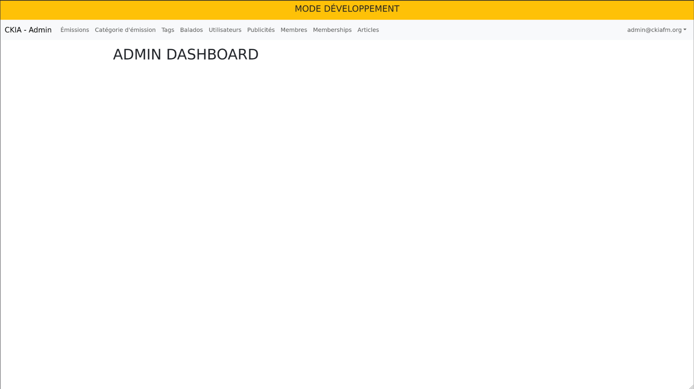{ width=100% }

Si le compte avec lequel vous vous connectez n'a pas le status d'admin, vous
aurez uniquement accès aux émissions et podcasts associés à votre compte.

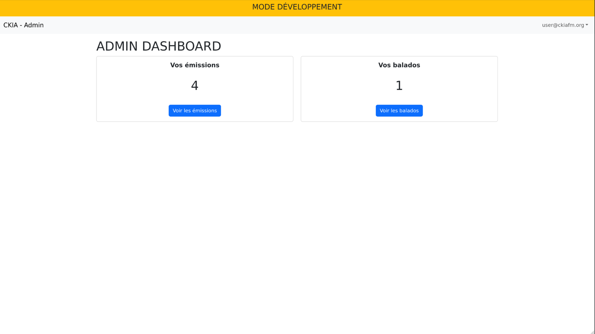{ width=100% }

### Gestion des utilisateur - admin seulement

`https://ckiafm.org/admin/users`

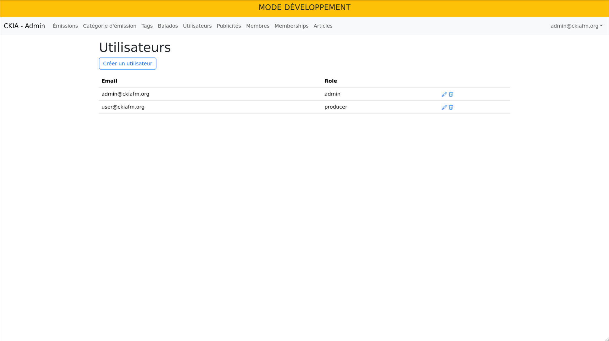{ width=100% }

La section de gestion des utilisateurs est très simple. Elle est composé d'un
tableau contenant tous les comptes utilisateur et permet à un admin de créer,
modifier ou supprimer des comptes.

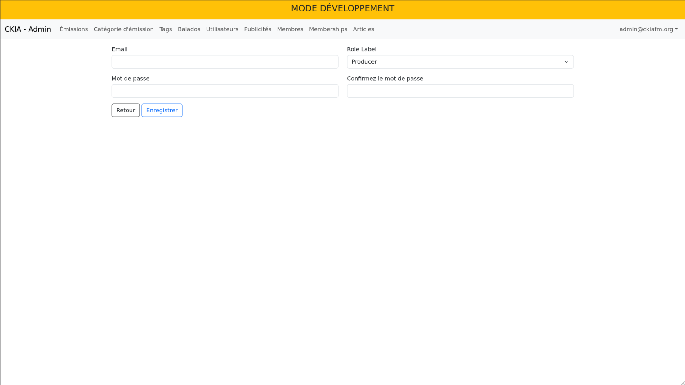{ width=100% }

### Émissions

`https://ckiafm.org/admin/emissions`

#### Admin

Seuls les admins peuvent créer des émissions et seuls les admins peuvent créer
et modifier les heures de diffusions d'une émission.

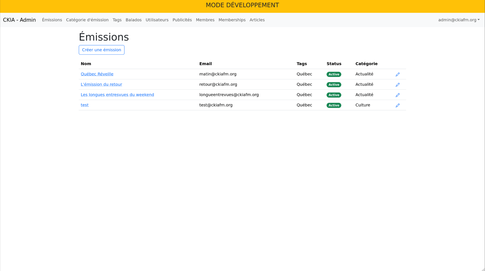{ width=100% }

Pour créer des diffusions d'une émission, vous devez aller sur la page
d'administration de l'émission et cliquer sur le bouton "Créer une diffusion".

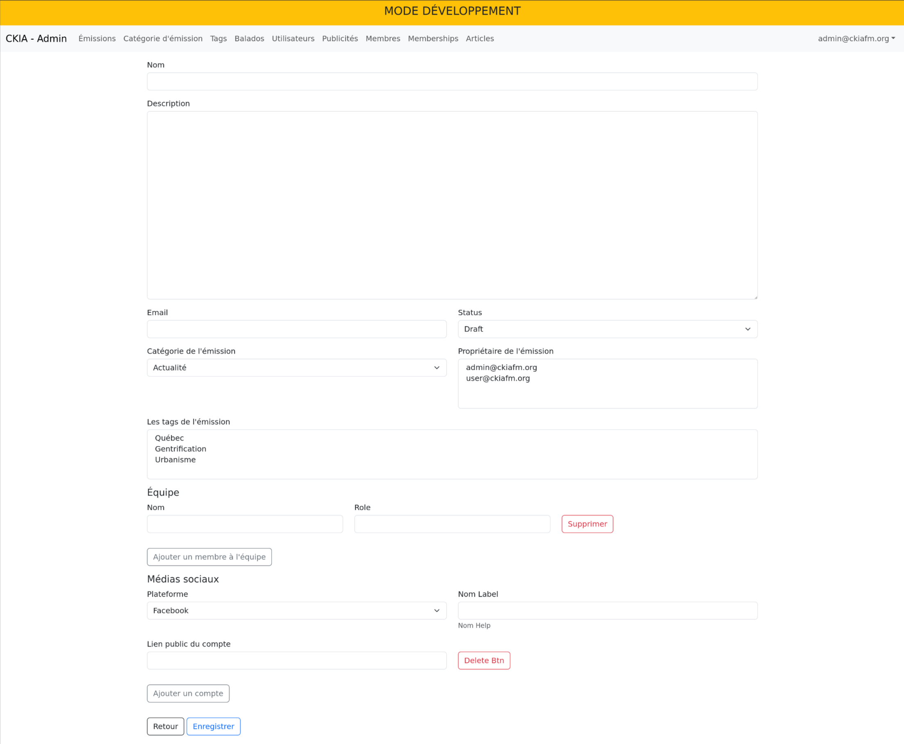{ width=100% }

#### Producteurs / productrices

Une fois que l'émission a été créé par un-e admin, le producteur ou la
productrice peut aller remplir la description, définir les membres de l'équipe
ou y ajouter des épisodes.

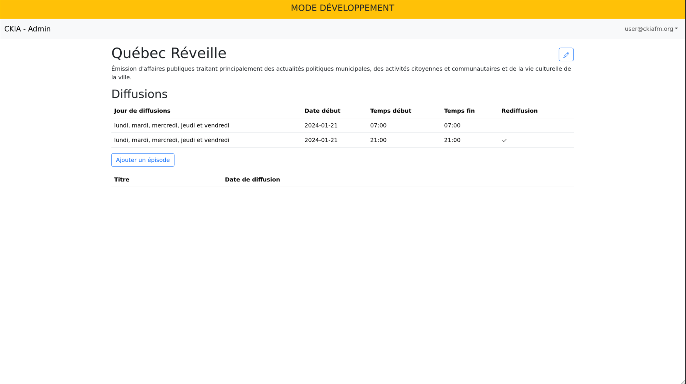{ width=100% }

##### Épisodes

Lorsque vous êtes un-e producteurs / productrices avec des émissions et des
podcasts, vous pouvez aller sur votre émission ou podcast (à partir de la liste
des émissions ou des podcasts) et ajouter des épisodes.

Lorsque vous ajoutez un épisode à une émission, le formulaire vous permet de
remplir la feuille de route de l'émission.

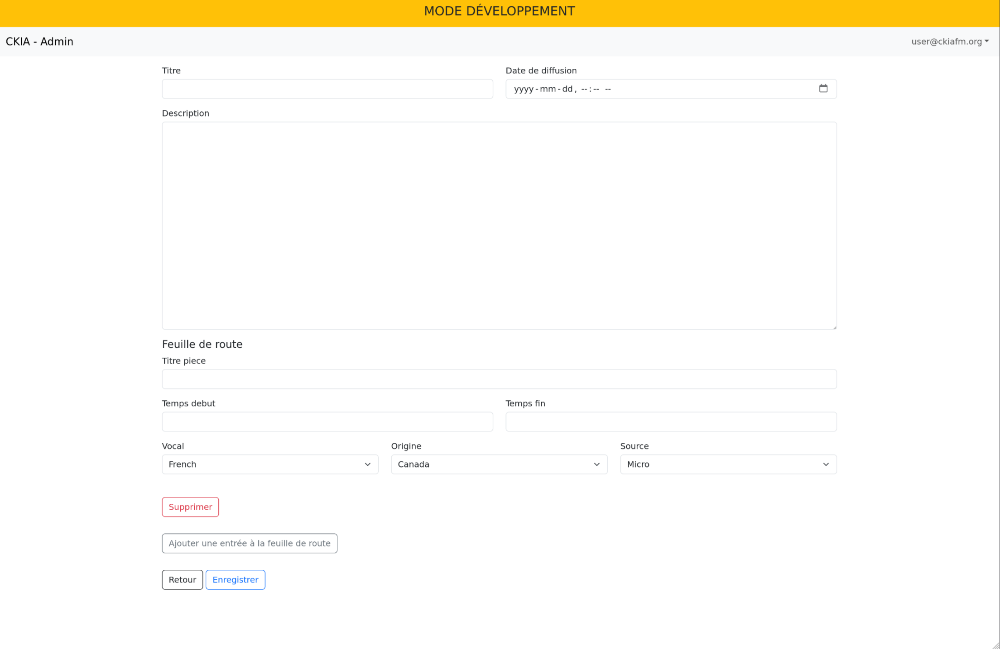{ width=100% }

##### Catégorie d'émission - admin seulement

`https://ckiafm.org/admin/categorie_emissions`

Les catégories d'émissions ont été désigné uniquement pour faciliter
l'affichage de la programmation. Vous pouvez choisir un nom et une couleur. Le
but c'est que les catégories soient assez larges contrairement aux tags, étant
donné qu'on ne veut pas nécessairement avoir une catégorie par émission dans la
programmation.

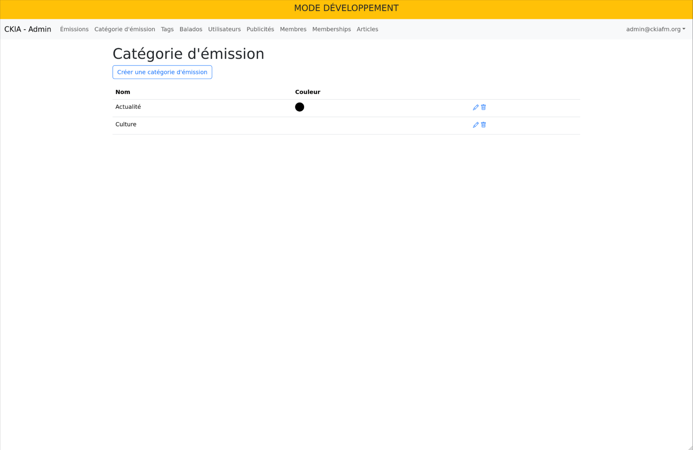{ width=100% }

Le bouton Créer une catégorie d'émission vous permet d'accéder au formulaire de
création d'une nouvelle catégorie d'émission.

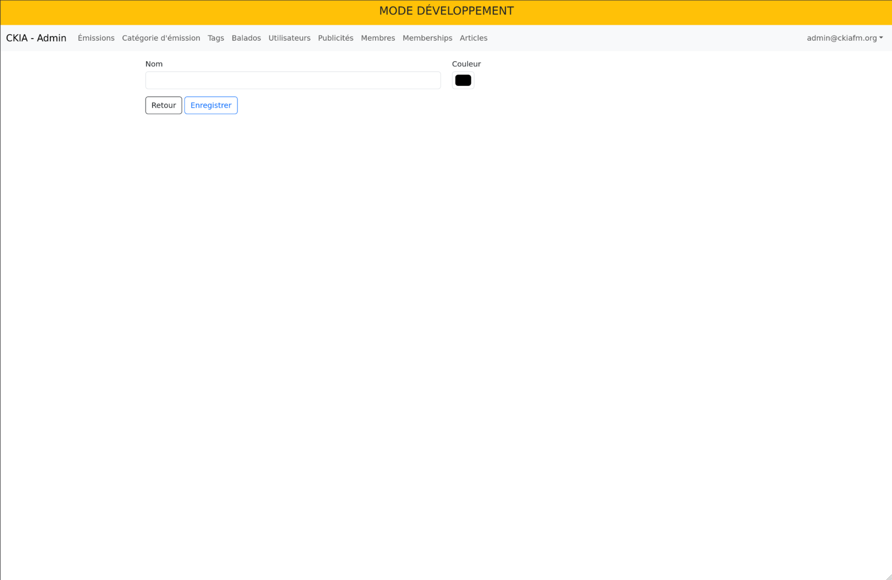{ width=100% }

### Balados

`https://ckiafm.org/admin/balados`

#### Admin

Les admins sont les seul-e-s à pouvoir créer et supprimer les balados. De
plus, iels peuvent modifier toutes les informations de n'importe quel balados.

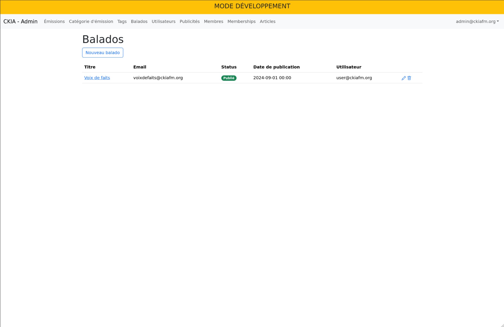{ width=100% }

#### Producteurs / productrices

Les producteurs et productrices peuvent uniquement voir, modifier et ajouter
des épisodes à leurs balados.

Pour ajouter un épisode, l'utilisateur doit aller dans la section admin du
podcasts et cliquer sur le bouton « ajouter un nouvel épisode ».

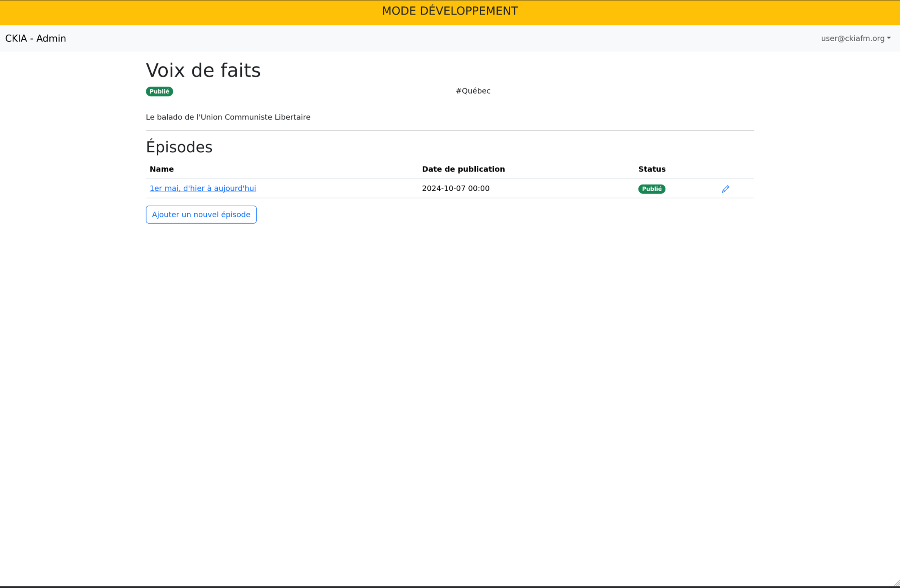{ width=100% }

### Articles - admin seulement

`https://ckiafm.org/admin/articles`

La section articles est celle utilisée pour publier les publications
officielles de la station. Communiqués de presse, articles de journaliste
écrit, etc.

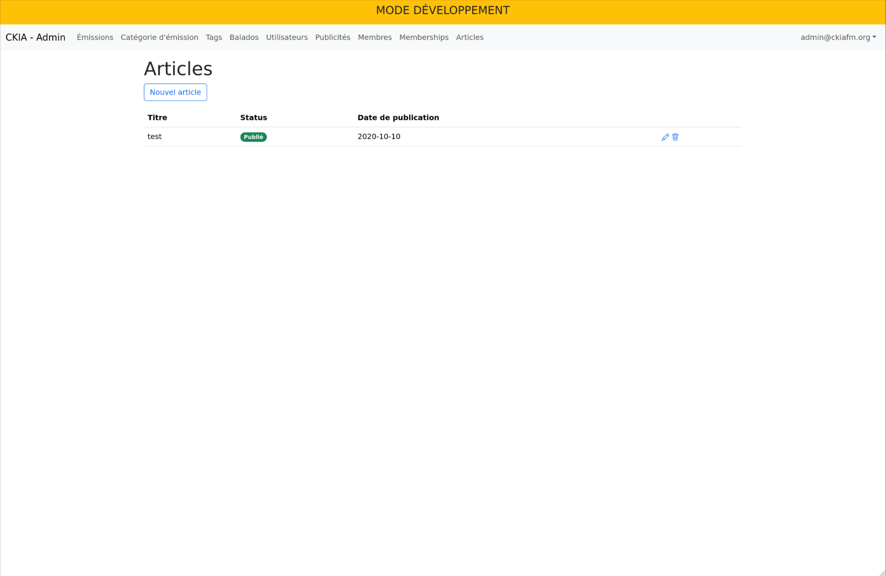{ width=100% }

Un article peut être écrit avant d'être publié et il ne sera visible au public
que si la date de publication est atteinte et que le status est publié.

Le contenu des articles est formaté à l'aide d'un langage appelé markdown. Vous
pouvez consulter la page suivante pour avoir les bases du langage:
[https://www.markdownguide.org/cheat-sheet/](https://www.markdownguide.org/cheat-sheet/).

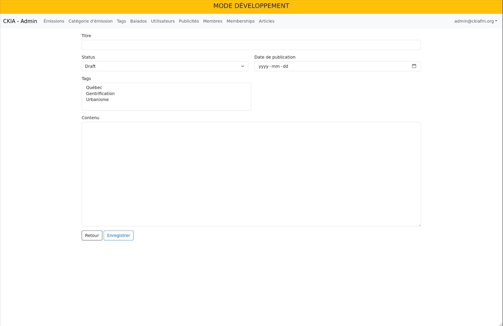{ width=100% }

### Tags - admin seulement

`https://ckaifm.org/admin/tags`

Les tags sont assez simple à gérer, il s'agit uniquement d'un nom et les tags
peuvent être assignés à différents éléments (articles, émissions, épisodes,
balados, épisode de balados).

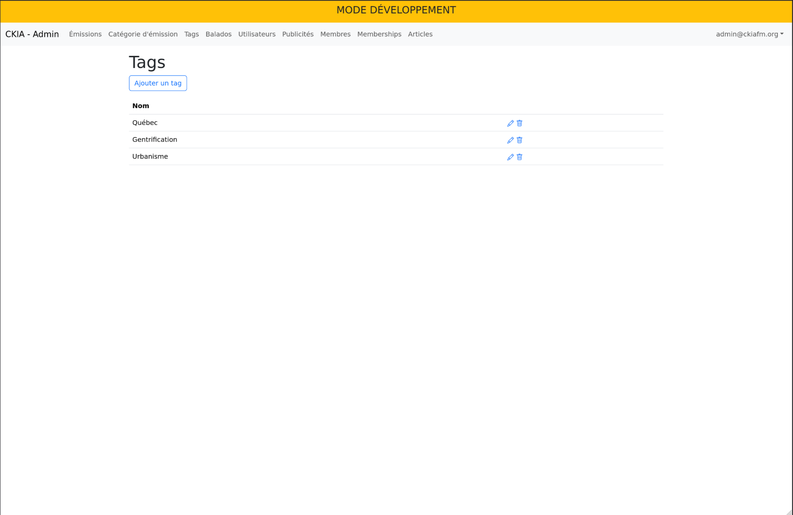{ width=100% }

### Publicité - admin seulement

`https://ckiafm.org/admin/publicites`

Les admins sont les seuls à pouvoir éditer les créer, modifier ou supprimer une publicité.

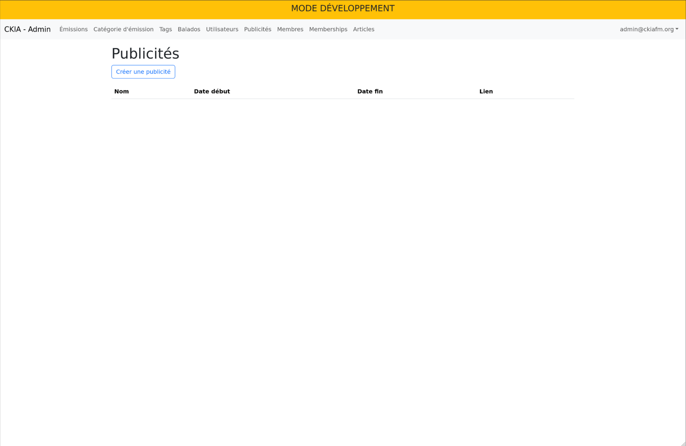{ width=100% }

Ce n'est vraiment pas très compliqué, il faut simplement fournir un nom, un
lien, un format, une date de début et une date de fin d'affichage ainsi que
l'image de la pub et la site s'assurera de l'afficher de façon aléatoire sur le
site.

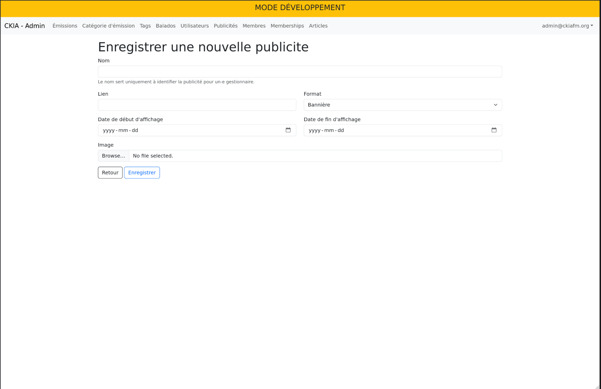{ width=100% }
